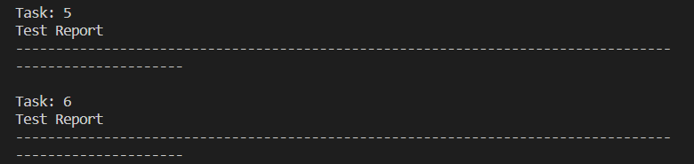
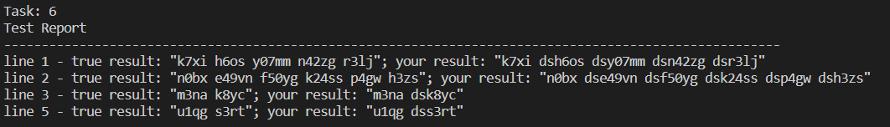

# OzonTestsManager
Я писал эту библиотеку для себя, так как хотел тестировать свои решения задач от **Ozon Techpoint**, надеюсь и вам пригодиться, темболее когда на решение всех задач будет всего **5 часов** 😅. Если кратко, то все что вам нужно для тестирование: скачать **.zip** архив с тестами от **Ozon** с вашей задачей, скопировать путь, и.. **Все!**
# Оглавление

# Manual
Данная библиотека предоставляет быстрое тестирование для вашего решения задачи с контекста **OzonTech**.

**Ссылка на nuget-пакет:**
**https://www.nuget.org/packages/IgorPetrovcm.OzonTestsManager**

**устанавливайте версию библиотеки 2.0.0, только в этой версии есть описанные ниже решения**

**Ссылка на github:** 

**https://github.com/IgorPetrovcm/OzonTech-TestsManager**

## С чего начать

Прежде всего нужно скачать **.zip** архив со страницы вашей задачи, обычно нужно долистать в самый конец страницы:


Подключите библиотеку с помощью **nuget**. Далее в проекте вашего решения создайте поток класса `OzonTasks` и в параметры конструктора вставим путь к архиву, **путь должен быть полный**:
```csharp
using (OzonTasks ozonTasks = new OzonTasks(@"C:\..folders..\Downloads\4.zip"))
{

}
``` 

При открытии потока в вашем проекте появяться исходники, в папке **bin/**, а точнее **.json-файл** под названием "**OzonTestsManager_history_status**" и папка с тестами, в которую библиотекой был разорхивирован архив по указанному вами пути "**Test_Directory**". Предназначение **.json-файла** расскажу потом, это не так важно. 

## Как тестировать свое решение

В открытом потоке и будет ваше решения. Для работы с каждым заданием из архива вам предоставлен класс `OzonCurrentTask`, который и хранит строки задания - "**тесты**", и ответы на них. 

Здесь мы получем `task` из коллекции `OzonCurrentTask` с помощью итератора `GetTasks`:
```csharp
using (OzonTasks ozonTasks = new OzonTasks(@"C:\..folders..\Downloads\4.zip"))
{
    foreach (OzonCurrentTask task in ozonTasks.GetTasks())
    {

    }
}
``` 
[Подробнее о свойствах OzonCurrentTask] 

Действия дальше могут показаться бессмысленными, но я не смог это сделать короче. Здесь мы получаем каждый тест или строку из задания и уже работаем с ней:
```csharp
foreach (OzonCurrentTask task in ozonTasks.GetTasks())
{
    foreach (string test in task)
    {
      //ваше решения
    }
}
```
## На практике

Представим такое задание: *Дана строка чисел, отсортируйте числа в ней по возрастанию*.

На вход получаем:
```
2 3 9 1 4
9 1
0 9 3 6
```

На выход должно получиться:
```
1 2 3 4 9
1 9
0 3 6 9
```

Вот как это решить и протестировать с помощью библиотеки `OzonTestsManager`:

```c#
// Путь к скачанному архиву с заданиями: C:\Downloads\test.zip

using (OzonTasks tasks = new OzonTasks("C:\\Downloads\\test.zip"))
{
    foreach (OzonCurrentTask task in tasks)
    {
        foreach (string test in task)
        {
            Array.Sort(test.ToArray());

            task.yourResult.Add(test);
        }
    }
}
```

Просто добавьте ваше решение теста в `yourResult` для текущего `task`, и все🎉!

Если у вас не получаеться результат теста в виде строки, например, коллекция **int** то укажите это в методе `Add<T>(IEnumerable yourResult)` вашего `yourResult`:

```csharp
task.yourResult.Add<int>(myArray)
```

## По итогу 

По завершению потока `OzonTasks`, вызывается его реализация `Dispose()`, которая сама, любезно выведет в консоль результаты ваших решений.

Пример отчета без ошибок:



Пример отчета с ошибками в вашем решении:



# Контакты

Telegram: **@IGOR_PETR**

GitHub: **https://github.com/IgorPetrovcm**